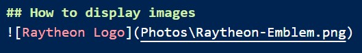
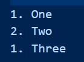
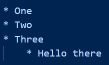
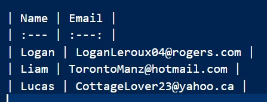
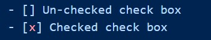

# Markdown Cheat Sheet
###### ***Written By Logan Leroux***

## How to bold
To bold text you surround it in double astricks.

For Example:
\*\*My Text\*\* --> **My Text**

## How to use italics
To italisize text you suround it in single astricks.

For Example:
\*My text\* --> *My Text*

## How to bold and italisize text
To bold and italisize text you surround it in tripple astricks.

For example:
\*\*\*My Text\*\*\* --> ***My Text***

## How to cross off text
To cross off text you surround it in double tildas

For Example:
\~\~My Text\~\~ --> ~~My Text~~

## How to highlight text
To highlight text you have to use HTML in your markdown file. To do this surround it in \<mark> and\</mark>.

For Example:
\<mark>My Text\</mark> --> <mark>My Text</mark>

## How to use HTML tags to superscript text
To superscript text you have to use HTML flagsin your markdown file. To do this surround it in \ and\.

For Example:
X\2\ --> X2</mark>

## How to use HTML tags to superscript text
To superscript text you have to use HTML flagsin your markdown file. To do this surround it in \ and\.

For Example:
X\2\ --> X2

## How to use an emoji in markdown
To use an emoji in your markdown file just copy and paste it from your clipboard. I am sure there is probably some HTML tag that you could also use.

For example: 😁

## A good way to render code (Single line)
for single lines of code enclose your code in singe apostraphes.

For Example:
\'const int age = 21\' --> 'const int age = 21'

## A good way to render code (Multi line)
for single lines of code enclose your code in tripple apostraphes.

For Example:
\'\'\'const int age = 21\'\'\' -->   
'''  
const int age = 21  
if age > 19:  
    print("You are not a teenager anymore)  
'''

## How to create a hyperlink
To create a hyperlink use the following structure:  
\[Google.com](https://google.com)
-->
[Google.com](https://google.com)

Alternativly, if you do not care to give your link a name then just write it out as is: https://google.com and markdown will just interpret that as "I want to create this link."

## How to display images

Results:

## Text blocks
To create blocks of text start that line of markdown with ">".  
For Example:  
\> Blocked text  
Ouputs:  
> Blocked text

## Nested blocked text
The outermost block is created by using ">" to start that line of markdown. To create a block inside that block use ">>" to start the next line.

For Example:  
> Outer Block
>> Middle Block
>>> Inner Block  
>>>> Inner Inner Block

## Putting lines between things lines of text
To put separrating lines between text write at leats three astricks between the two lines of text you want to devide.  
For Example:  
Top line of text  
\*\*\*  
Middle line of text  
\*\*\*\*\*  
Bottom line of text

Results in:

Top line of text
***
Middle line of text
***
Bottom line of text

## Creating numbered lists
Just do this:  

1. One
2. Two
1. Three

## Creating bullet point lists
Just do this:  

* One
* Two
* Three  
    * Hello there

# Creating a table (github markdown specific)
Use this structure  
  

Results:  

| Name | Email |  
| :--- | :---: |
| Logan | LoganLeroux04@rogers.com |
| Liam | TorontoManz@hotmail.com |
| Lucas | CottageLover23@yahoo.ca |

## Creating check boxes
Use the following structure:  
  
Results: 

- [ ] Un-checked check box
- [X] Checked check box

## The End
 